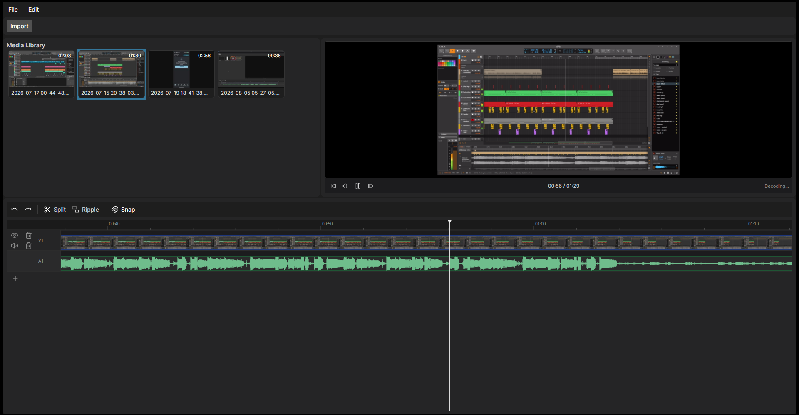

# Fig

Fig is an open-source non-linear video editor built with C# and Avalonia. It is designed around a single idea: professional editing should not be locked behind paywalls or painfully slow exports.




This is an early-stage project. The core engine (timeline, media pipeline, and playback) is being built first, with the interface growing around it.

## Status

Actively developed. Expect rough edges, incomplete features, and frequent changes. The project is clean on purpose: no AI-generated code has been merged, and contributors are expected to understand every line they add.

## Features

- **Timeline editing**: drag, move, and resize clips; trim from either edge; split at the playhead; ripple delete with a fully undoable command history.
- **Linked audio**: dropping a video that contains audio automatically creates a linked audio clip on an audio track. Video and its audio move, trim, cut, and ripple together.
- **Media previews**: aspect-correct filmstrips tiled across video clips and sample-accurate waveforms rendered in real time from decoded audio peaks.
- **Synchronous playback**: audio is the master clock. A background producer decodes and mixes the audible clips into a ring buffer while the device drains it, so the timeline position and video preview follow the audio in real time.
- **Keyboard-first controls**: a data-driven gesture system that maps input combinations to timeline actions. Mappings are stored as editable configuration, not hardcoded.
- **Project validation**: opening a project checks every asset, detects offline sources, and regenerates stale or missing previews, with visible progress and a summary of what was repaired.
- **Resizable workspace**: media library, preview, and timeline panels are separated by draggable splitters.

## Requirements

- .NET SDK 10.0 or later
- A desktop platform supported by Avalonia (Windows, macOS, Linux)
- An audio output device for playback (PulseAudio, PipeWire, or ALSA on Linux)

## Building and running

```bash
dotnet build
dotnet run --project src/Fig.App
```

## Tests

The test suite covers the timeline model, edit operations, gesture parsing, media probing and generation, audio mixing, project persistence, and validation.

```bash
dotnet test
```

## Project layout

```
src/
  Fig.Core/    Domain engine: timeline, media pipeline, audio mixing, gestures, project storage
  Fig.App/     Avalonia desktop application: views, view models, SVG icons, playback device
tests/
  Fig.Core.Tests/
```

## Architecture notes

- `Fig.Core` has no UI dependency. Everything about how the timeline behaves, how media is decoded, and how audio is mixed lives here and is covered by unit tests.
- The playback engine treats the audio device as the authoritative clock. The video preview and timeline playhead follow it, which is what keeps audio and picture in sync.
- Media artifacts (thumbnails, filmstrips, waveforms) are generated once, cached on disk per project, and repaired automatically when a project is opened.

## Goals

Tracked against the current build.

**Legend:** ✅ Complete · 🟡 Partial / in progress · ⬜ Not started

| Status | Goal | Notes |
| :---: | :--- | :--- |
| 🟡 | Free video transitions | The core pain point: transitions shouldn't be pay-to-use. Cross-dissolve ships free with a full timeline UI (apply, select, resize, remove). The catalog has one type so far. |
| 🟡 | Fast export | Rendering should take seconds to minutes for short projects. Full timeline → MP4 (H.264/AAC) export works; encoder threading, quality presets, and hardware encoding are still to come. |
| 🟡 | Clean, modern, intuitive interface | Keyboard-first Avalonia workspace that's easy to navigate. Functional, but panels and polish are still evolving. |
| ⬜ | Smart editing aids | Automatic cuts when voice isn't detected, and AI transcription. |
| ⬜ | Quick start for creators | Instant onboarding with tools and templates for popular niches. |

## Development Philosophy

Extending Fig goes like this:
1. Create a UML spec (this may or may not be required for certain things). PlantUML is used here for convenience, and UML helps me understand the architecture of the project and where things stand. AI can be used for assistance here, and this is actually where it properly follows instructions.
2. Create the implementation code for the systems.
3. Tests first, UI last. After the backend/headless infrastructure works, the UI can easily be built on top of it.

This is the design philosophy I use for other projects, and it keeps things maintainable and **extensible**.

## Contributing

AI generated pull requests are not accepted. This project stays clean because it has not been written by an AI, and polluting it with unexamined code would make it hard to develop and eventually abandoned. AI pull requests will not be reviewed.

AI is welcome as an assistant. If you architect a change yourself, understand every line of it, and review it like it was your own, that pull request can be discussed. Use the AI as an assistant/reference aggregator, not an agent that just spaghettifies code. Write your own code.

## License

Not yet licensed.
